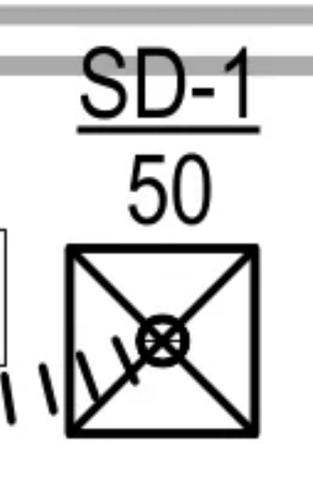
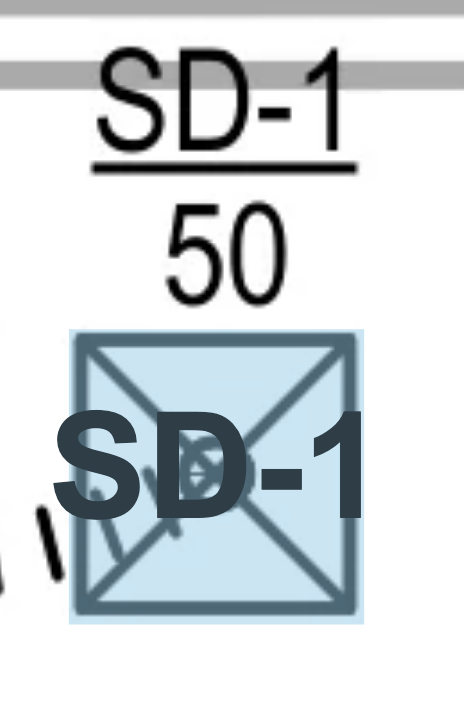

# Symbol Search Interview

## Overview

At Rebar, we have a feature called **Symbol Search**. This is a product engineering interview exercise where you'll implement a Symbol Search menu.

This is an **open-ended challenge** designed to evaluate how you think as a product engineer with minimal data. There's no single "right" answer—we're interested in your approach to designing user interfaces and handling real-world data structures.

## Background

Users work with construction/architectural PDF documents and need to find and place symbols across pages. The workflow is:

1. A user draws a box around a **symbol** they want to find (e.g., a linear diffuser)
2. This symbol is sent to our backend ML model
3. The backend returns a JSON response with coordinates of all matching detections found across the document
4. The user reviews each detection and **confirms** (places the symbol) or **rejects** (dismisses the false positive)
5. Your job: **Build the UI that lets users efficiently review and place these symbols**

**Note:** Steps 1-3 are simulated in this exercise. The search results and images are pre-generated. You are building steps 4-5.

<p>
  
  
</p>

---

## The Data

### Detection JSON Structure

The backend returns results in the following format (see `public/symbolSearchResults/results.json`):

```json
{
  "action": "symbolSearch",
  "detections": [
    {
      "x": 1529,           // center x coordinate
      "y": 598,            // center y coordinate  
      "bbox": [1510, 595, 1549, 601],  // bounding box [x1, y1, x2, y2]
      "conf": 1,           // confidence score (0-1)
      "page": 2,           // page number where detection was found
      "markup_id": 503709250,
      "symbol_search_id": "69c5416ad021afe98f6ac407"
    },
    // ... more detections
  ],
  "metadata": {
    "tool": {
      "id": "31ef062c-09fb-45d2-8537-15a96575420f",
      "category": "GRD - Linear Diffuser",
      "color": "#0F52BA", //blue
      "shape": "triangle",
      "name": "LD-1"
    }
  }
}
```

### Key Fields

| Field | Description |
|-------|-------------|
| `bbox` | Bounding box as `[x1, y1, x2, y2]` pixel coordinates |
| `conf` | Confidence score from 0 to 1 (1 = exact match, lower = less certain) |
| `page` | PDF page number where the symbol was found |
| `x`, `y` | Center point of the detection |

### Helpers

Helper functions are available in `src/helpers/index.ts`:

**`getSnippetUrl(detection)`** - Returns the URL for a detection's image snippet.

```typescript
import { getSnippetUrl } from './helpers'

// Returns the image URL for a detection
const imageUrl = getSnippetUrl(detection)
// e.g., "/symbolSearchResults/images/detection-2-1510-595-1549-601.png"
```

**`createToolSVG(tool, size?)`** - Creates an SVG representation of the tool based on its `color` and `shape`.

```typescript
import { createToolSVG } from './helpers'

const toolSVG = createToolSVG(metadata.tool, 32)
// Returns an SVG string with the correct color and shape
```

The user's original detection (what they searched for) is stored at:
```
/symbolSearchResults/images/user-detection.png
```

## The Challenge

### Getting Started

```bash
npm install
npm run dev
```

The app loads a PDF viewer with a Symbol Search panel on the right side. The panel currently:
- Shows the user's original detection image
- Has a "Search" button that fetches the results JSON
- Displays the raw JSON (your job is to improve this!)

### Files to Work With

- `src/SymbolSearch.tsx` - The Symbol Search panel component (start here)
- `public/symbolSearchResults/results.json` - The detection results data
- `public/symbolSearchResults/images/` - 336 detection image snippets

---

### Round 1: The Review Sidebar

**Goal:** Transform the raw JSON into a functional "Result Feed."

**The Spec:** Create a sidebar that renders each detection as a card. The results contain roughly **335 detections** from a single search—think about how you'll display them efficiently.

**Requirements:**
- Each card must show the detection snippet image and its confidence score (`conf`)
- Display the tool metadata (name: `LD-1`, category: `GRD - Linear Diffuser`) in the sidebar header
- Clicking a card must set it as the "Active" detection with a visual highlight

**Helper:** Use the provided `getSnippetUrl(detection)` function to get the image URL for each detection.

---

### Round 2: The "Zoom & Place" Workflow

**Goal:** Connect the Sidebar to the PDF Canvas.

**The Spec:** When a detection is selected in the sidebar:

1. **Zoom/Center:** The PDF viewer must center on that detection's `x`, `y` coordinates
2. **Highlight:** Draw a highlight box on the PDF canvas at the detection's `bbox` using the tool's `color` (`#0F52BA`) and `shape` (`triangle`)

**Helper:** Use `createToolSVG(metadata.tool, size?)` from `src/helpers` to create an SVG representation of the placed symbol.

**The Action:** Add "Confirm" and "Reject" buttons to the active card.

- Clicking "Confirm" should "place" the equipment—visually distinguish placed assets from pending search results (e.g., change status/color/icon)
- Clicking "Reject" should dismiss the detection from the results (the user is saying "this is not a match")

---

### Round 3: The "Construction Reality" Stress Test

At Rebar, we can't always ship the "perfect" feature. We have to prioritize what delivers the most value under time constraints.

**Choose one of the following real-world challenges to address.** Be prepared to justify why you chose this area and how your solution solves the user's specific pain point.

- **The Scale Challenge:** Real projects (like hospitals) can return 1,000+ detections in a single search. How does your current architecture handle that volume of data both in terms of performance and user interface?

- **The Velocity Challenge:** Accepting symbols one-by-one is not always the best approach when a user needs to verify hundreds of items per hour. How would you redesign the interaction model to maximize placement speed?

- **The Accuracy Challenge:** Backend ML models are never 100% certain. You will have exact matches, "close enough" guesses, and complete misses. How does the user efficiently navigate this range of certainty to find what actually matters?

- **The Concurrency Challenge:** Users rarely do one thing at a time. They may trigger multiple different symbol searches back-to-back. How does your state management handle multiple independent result sets without data colliding?

- **The Feedback Loop:** Our ML models only get better if they know when they were right or wrong. How would you capture and send "Accept/Deny" signals back to the backend? How do you ensure this doesn't slow down the user's workflow?

- **Show Your Strengths:** Maybe you're great at design, or code quality, or UX polish. Refine Rounds 1-2 and make them shine—accessibility, animations, interactions, or whatever you think matters most.

- **The Wildcard:** What is the biggest "dealbreaker" you see in the current implementation that would prevent a user from actually finishing their job?

---

## What We're Looking For

- **Product Thinking:** How do you prioritize what to show the user?
- **Data Handling:** How do you transform raw API data into a usable format?
- **UX Decisions:** Sorting, grouping, pagination, visual hierarchy
- **Code Quality:** Clean, readable, maintainable code
- **Problem Solving:** How you approach ambiguity with minimal specifications

Good luck!
